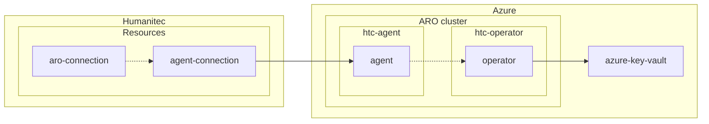
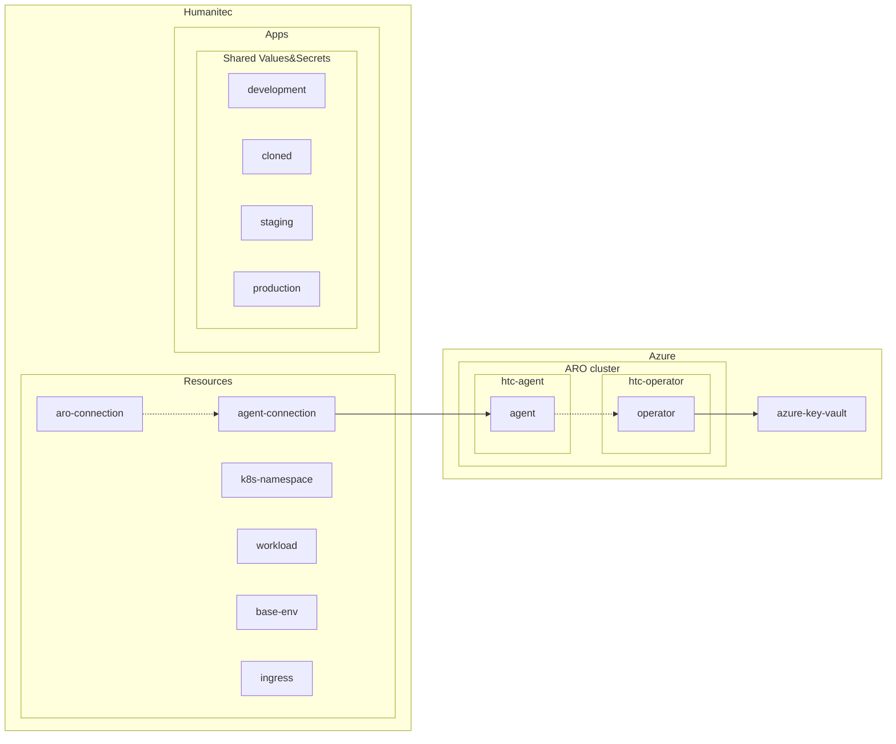

# MVP Workshop - Day 1

Platform Engineer (`Administrator`) sharing her/his screen running `humctl` and `terraform`.

**Objective: Deploy one secure Workload in multiple Environments in your ARO cluster, exposed by your DNS/Ingress.**

TOC:
- [Prerequisites](#prerequisites)
- [Review Cluster setup](#review-cluster-setup)
- [Review RBAC setup](#review-rbac-setup)
- [Define your `k8s-namespace` res def](#define-your-k8s-namespace-res-def)
- [Define your `base-env` res def](#define-your-base-env-res-def)
- [(Dev) Onboard a project](#dev-onboard-a-project)
- [(Dev) Deploy your first Workload](#dev-deploy-your-first-workload)
- [(Dev) Analyze the Deployment error](#dev-analyze-the-deployment-error)
- [Define your `workload` res def](#define-your-workload-res-def)
- [Define your `dns` res defs](#define-your-dns-res-defs)
- [Define your `ingress` res defs](#define-your-ingress-res-defs)
- [(Dev) Use Shared Values&Secrets](#dev-use-shared-valuessecrets)
- [(Dev) Create new Environments](#dev-create-new-environments)
- [Wrap up](#wrap-up)
- [Resources](#resources)

## Prerequisites

- [ ] Let's select one container in your own registry, accessible from the cluster used during this workshop.
- [ ] Install [`humctl`](https://developer.humanitec.com/platform-orchestrator/cli/)

```bash
humctl login
```

```bash
export HUMANITEC_ORG=FIXME

humctl set org ${HUMANITEC_ORG}
```

`main.tf`:
```terraform
terraform {
  required_providers {
    humanitec = {
      source = "humanitec/humanitec"
    }
  }
}
```

```bash
terraform init -upgrade
```

## Review Cluster setup



```bash
humctl get res-def
```

```bash
humctl resources check-connectivity --app test --env development
```

**Question: What is this `k8s-cluster` res def telling us?**

Open the Humanitec Portal to see this res def:
```bash
echo -e "https://app.humanitec.io/orgs/${HUMANITEC_ORG}/resources/definitions/aro-cluster"
```

## Review RBAC setup

[Official docs](https://developer.humanitec.com/platform-orchestrator/security/rbac/):
- Org level
- App level
- Env Type level

## Define your `k8s-namespace` res def

`k8s-namespace.tf`:
```terraform
resource "humanitec_resource_definition" "custom_namespace" {
  driver_type = "humanitec/template"
  id          = "custom-namespace"
  name        = "custom-namespace"
  type        = "k8s-namespace"
  driver_inputs = {
    values_string = jsonencode({
      templates = {
        init      = "name: $${context.env.id}-$${context.app.id}"
        manifests = <<END_OF_TEXT
namespace.yaml:
  location: cluster
  data:
    apiVersion: v1
    kind: Namespace
    metadata:
      labels:
        pod-security.kubernetes.io/enforce: restricted
      name: {{ .init.name }}
END_OF_TEXT
        outputs   = "namespace: {{ .init.name }}"
      }
    })
  }
}

resource "humanitec_resource_definition_criteria" "custom_namespace" {
  resource_definition_id = resource.humanitec_resource_definition.custom_namespace.id
  class                  = "default"
}
```

```bash
terraform plan -out tf.plan

terraform apply tf.plan
```

```bash
humctl get res-defs
```

**Question: What is this `k8s-namespace` res def telling us?**

Open the Humanitec Portal to see this res def:
```bash
echo -e "https://app.humanitec.io/orgs/${HUMANITEC_ORG}/resources/definitions/custom-namespace"
```

## Define your `base-env` res def

```terraform
resource "humanitec_resource_definition" "base_env" {
  driver_type = "humanitec/template"
  id          = "base-env"
  name        = "base-env"
  type        = "base-env"
  driver_inputs = {
    values_string = jsonencode({
      templates = {
        manifests = <<END_OF_TEXT
netpol-denyall.yaml:
  location: namespace
  data:
    apiVersion: networking.k8s.io/v1
    kind: NetworkPolicy
    metadata:
      name: deny-all
    spec:
      podSelector: {}
      policyTypes:
      - Ingress
      - Egress
END_OF_TEXT
      }
    })
  }
}

resource "humanitec_resource_definition_criteria" "base_env" {
  resource_definition_id = resource.humanitec_resource_definition.base_env.id
  class                  = "default"
}
```

```bash
terraform plan -out tf.plan

terraform apply tf.plan
```

```bash
humctl get res-defs
```

**Question: What is this `base-env` res def telling us?**

Open the Humanitec Portal to see this res def:
```bash
echo -e "https://app.humanitec.io/orgs/${HUMANITEC_ORG}/resources/definitions/base-env"
```

## (Dev) Onboard a project

```bash
export APP=FIXME

humctl create app ${APP}
```

```bash
humctl get envs --app ${APP}
```

```bash
humctl create env staging --type staging --app ${APP}

humctl create env production --type production --app ${APP}
```

## (Dev) Deploy your first Workload

`score.yaml`:
```yaml
apiVersion: score.dev/v1b1
metadata:
  name: my-sample-workload
containers:
  my-sample-container:
    image: .
```

```bash
humctl score validate score.yaml --strict
```

```bash
export IMAGE=FIXME

humctl score deploy -f score.yaml --image ${IMAGE} --app ${APP} --env development --wait
```

## (Dev) Analyze the Deployment error

Check the logs of the previous command.

Get the Deployment error:
```bash
humctl get deploy-error --app ${APP} --env development
```

Open the Humanitec Portal to see this error:
```bash
echo -e "https://app.humanitec.io/orgs/${HUMANITEC_ORG}/apps/${APP}/envs/development/"
```

## Define your `workload` res def

```terraform
resource "humanitec_resource_definition" "custom_workload" {
  driver_type = "humanitec/template"
  id          = "custom-workload"
  name        = "custom-workload"
  type        = "workload"
  driver_inputs = {
    values_string = jsonencode({
      "templates" = {
        "outputs" = <<END_OF_TEXT
update:
  - op: add
    path: /spec/securityContext
    value:
      fsGroup: 1000
      runAsGroup: 1000
      runAsNonRoot: true
      runAsUser: 1000
      seccompProfile:
        type: RuntimeDefault
  {{- range $containerId, $value := .resource.spec.containers }}
  - op: add
    path: /spec/containers/{{ $containerId }}/securityContext
    value:
      allowPrivilegeEscalation: false
      capabilities:
        drop:
          - ALL
      privileged: false
      readOnlyRootFilesystem: true
  {{- end }}
END_OF_TEXT
      }
    })
  }
}

resource "humanitec_resource_definition_criteria" "custom_workload" {
  resource_definition_id = resource.humanitec_resource_definition.custom_workload.id
  class                  = "default"
}
```

```bash
terraform plan -out tf.plan

terraform apply tf.plan
```

Redeploy your Workload:
```bash
humctl deploy env development --app ${APP} --wait
```

**Question: have you noticed? It's not `humctl score deploy` here.**

## (Dev) Define your `dns` res def

`variables.tf`:
```terraform

```

`dns_config.tf`:
```terraform
resource "humanitec_resource_definition" "dns_config" {
  driver_type    = "humanitec/echo"
  id             = "dns-config"
  name           = "dns-config"
  type           = "config"
  driver_inputs = {
    values_string = jsonencode({
      "base_domain" = var.base_domain
    })
  }
}

resource "humanitec_resource_definition_criteria" "dns_config" {
  resource_definition_id = resource.humanitec_resource_definition.dns_config.id
  res_id                 = "dns"
  force_delete           = true
}
```

`custom_dns.tf`:
```terraform
resource "humanitec_resource_definition" "custom_dns" {
  driver_type = "humanitec/template"
  id          = "custom-dns"
  name        = "custom-dns"
  type        = "dns"

  driver_inputs = {
    values_string = jsonencode({
      templates = {
        outputs = <<EOL
host: $${context.app.id}-$${context.env.id}.${var.base_domain}
EOL
      }
    })
  }

  provision = {
    ingress = {
      match_dependents = false
      is_dependent     = false
    }
  }
}

resource "humanitec_resource_definition_criteria" "custom_dns" {
  resource_definition_id = humanitec_resource_definition.custom_dns.id
  class                  = "default"
}
```

```bash
export BASE_DOMAIN=FIXME

terraform plan -var base_domain=${BASE_DOMAIN} -out tf.plan

terraform apply tf.plan
```

Redeploy your Workload:
```bash
humctl deploy env development --app ${APP} --wait
```

**Question: What's happening? What's missing?**

Let's update our `score.yaml` file:
```yaml
apiVersion: score.dev/v1b1
metadata:
  name: my-sample-workload
containers:
  my-sample-container:
    image: .
resources:
  dns:
    type: dns
  route:
    type: route
    params:
      host: ${resources.dns.host}
      path: /
      port: 8080
service:
  ports:
    tcp:
      port: 8080
      targetPort: 8080
```

```bash
humctl score deploy -f score.yaml --image ${IMAGE} --app ${APP} --env development --wait
```

**Question: What's happening? What's missing?**

## Define your `ingress` res def

```terraform
resource "humanitec_resource_definition" "custom_ingress" {
  driver_type = "humanitec/ingress"
  id          = "custom-ingress"
  name        = "custom-ingress"
  type        = "ingress"

  driver_inputs = {
    values_string = jsonencode({
      "class"  = "openshift-default"
      "no_tls" = true
      "annotations" = {
        "route.openshift.io/termination" = "edge"
      }
    })
  }
}

resource "humanitec_resource_definition_criteria" "custom_ingress" {
  resource_definition_id = humanitec_resource_definition.custom_ingress.id
  class                  = "default"
}
```

```bash
terraform plan -var base_domain=${BASE_DOMAIN} -out tf.plan

terraform apply tf.plan
```

Redeploy your Workload:
```bash
humctl deploy env development --app ${APP} --wait
```

## Use Shared Values&Secrets

```bash
humctl create value DYNAMIC your-value --app ${APP}
```

```bash
humctl create value DYNAMIC your-value-overriden --app ${APP} --env development
```

Grab your available `SecretStore`'s `id` in `SECRET_STORE`:
```bash
humctl api get /orgs/${HUMANITEC_ORG}/secretstores
```

```bash
humctl create value TEST_SECRET test-secret --app ${APP} --is-secret-ref --secret-store ${SECRET_STORE}
```

Open the Humanitec Portal to see these Shared Values&Secrets:
```bash
echo -e "https://app.humanitec.io/orgs/${HUMANITEC_ORG}/apps/${APP}/envs/development/values-and-secrets-overrides"
```

`score.yaml`:
```yaml
apiVersion: score.dev/v1b1
metadata:
  name: my-sample-workload
containers:
  my-sample-container:
    image: .
    variables:
      STATIC_ENV_VAR: "Hello, static!"
      DYNAMIC_ENV_VAR: "${resources.env.DYNAMIC}"
      SECRET_ENV_VAR: "${resources.env.TEST_SECRET}"
```

```bash
humctl score deploy -f score.yaml --image ${IMAGE} --app ${APP} --env development --wait
```

## Create new Environments

Either create an empty Environment:
```bash
humctl create env cloned --type development
```
Or cloned if from another Environment:
```bash
humctl create env cloned --type development --from development
```

And then, either deploy a specific Workload in this `cloned` Environment:
```bash
humctl score deploy -f score.yaml --app ${APP} --env cloned --wait
```
Or, deploy the entire Environment in its actual state:
```bash
humctl deploy env cloned --app ${APP}
```

## Bonus

- Expose a specific `external` `class` for `dns` ([inspiration](https://developer.humanitec.com/platform-orchestrator/resources/resource-classes/))
- Create an explicit `k8s-service-account` ([inspiration](https://developer.humanitec.com/examples/resource-definitions/template-driver/serviceaccount/))

## Wrap up



- `humctl score available-resource-types` is listing to the Devs they golden paths supported.
- Let's look inside the cluster: `kubectl get all,workloads,resources,secretmappings`
- All `.tf` were about Org-level objects in Humanitec.
- All `humctl` commands creating objects in Humanitec were either at the App level, Env level or Workload's deployment level.
- Some of these `humctl` commands creating objects in Humanitec can be written in `.tf` too.
- Next steps: Operator and Terraform Driver. Anything else?

## Resources

- [More Score file examples](https://developer.humanitec.com/examples/score/)
- [More Res Defs examples](https://developer.humanitec.com/examples/resource-definitions/)
- [More Resource graph patterns](https://developer.humanitec.com/examples/resource-graph-patterns/)
