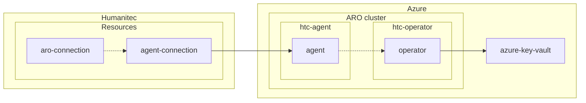

# MVP Workshop - Day 1

TOC:
- [Prerequisites](#prerequisites)
- [Golden path PE-1: I want to onboard a cluster to the Platform](#golden-path-pe-1-i-want-to-onboard-a-cluster-to-the-platform)
- [Review RBAC setup](#review-rbac-setup)
- [Wrap up](#wrap-up)
- [Resources](#resources)

## Golden path PE-1: I want to onboard a cluster to the Platform



```bash
humctl get res-def
```

```bash
humctl resources check-connectivity --app test --env development
```

Open the Humanitec Portal to see this res def:
```bash
echo -e "https://app.humanitec.io/orgs/${HUMANITEC_ORG}/resources/definitions/aro-cluster"
```

**[ ] Question: What is this `k8s-cluster` res def telling us?**

## Review RBAC setup

[Official docs](https://developer.humanitec.com/platform-orchestrator/security/rbac/):
- Org level
- App level
- Env Type level

Resources:
- [Humanitec Orchestrator Overview](https://developer.humanitec.com/training/fundamentals/platform-architecture/overview/)