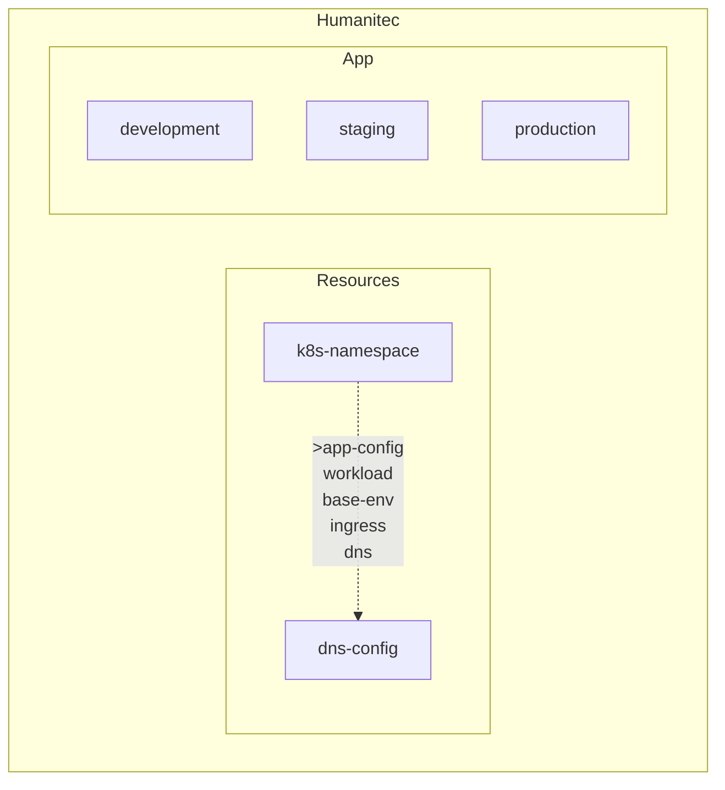

# MVP Workshop - Day 2 - As Platform Engineer,

- Golden path PE-2: I want to define and standardize higly secured Kubernetes Namespaces
- Golden path PE-3: I want to onboard a new Project
- Golden path PE-4: I want to allow my Devs to expose their Workloads via a DNS

TOC:
- [Prerequisites](#prerequisites)
- [Golden path PE-2: I want to define and standardize higly secured Kubernetes Namespaces](#golden-path-pe-2-i-want-to-define-and-standardize-higly-secured-kubernetes-namespace)
  - [Define a `k8s-namespace` res def](#define-a-k8s-namespace-res-def)
  - [Define a `base-env` res def](#define-a-base-env-res-def)
  - [Define a `workload` res def](#define-a-workload-res-def)
- [Golden path PE-3: I want to onboard a new Project](#golden-path-pe-3-i-want-to-onboard-a-new-project)
  - _At this stage, you can already deploy your first Workload._
- [Golden path PE-4: I want to allow my Devs to expose their Workloads via a DNS](#golden-path-pe-4-i-want-to-allow-my-devs-to-expose-their-workloads-via-a-dns)
  - [Define a `dns` res def](#define-a-dns-res-def)
  - [Define a `ingress` res def](#define-a-ingress-res-def)
- [Wrap up](#wrap-up)
- [Bonus](#bonus)
- [Resources](#resources)

## Prerequisites

- [ ] Install [`humctl`](https://developer.humanitec.com/platform-orchestrator/cli/).
- [ ] Install [`terraform`]().
- [ ] Got an invite to join the Humanitec Org as `Administrator`.

```bash
humctl login
```

```bash
export HUMANITEC_ORG=FIXME

humctl config set org ${HUMANITEC_ORG}
```

`main.tf`:
```terraform
terraform {
  required_providers {
    humanitec = {
      source = "humanitec/humanitec"
    }
  }
}
```

```bash
terraform init -upgrade
```

## Golden path PE-2: I want to define and standardize higly secured Kubernetes Namespaces

### Define a `k8s-namespace` res def

`k8s-namespace.tf`:
```terraform
resource "humanitec_resource_definition" "custom_namespace" {
  driver_type = "humanitec/template"
  id          = "custom-namespace"
  name        = "custom-namespace"
  type        = "k8s-namespace"
  driver_inputs = {
    values_string = jsonencode({
      templates = {
        init      = <<END_OF_TEXT
app_id: $${context.app.id}
name: $${context.env.id}-$${context.app.id}
cost_center: $${resources.config#app.outputs.cost_center}
bu_id: $${resources.config#app.outputs.bu_id}
END_OF_TEXT
        manifests = <<END_OF_TEXT
namespace.yaml:
  location: cluster
  data:
    apiVersion: v1
    kind: Namespace
    metadata:
      labels:
        pod-security.kubernetes.io/enforce: restricted
        app/id: {{ .init.app_id }}
        cost/center: {{ .init.cost_center }}
        bu/id: {{ .init.bu_id }}
      name: {{ .init.name }}
END_OF_TEXT
        outputs   = "namespace: {{ .init.name }}"
      }
    })
  }
}

resource "humanitec_resource_definition_criteria" "custom_namespace" {
  resource_definition_id = resource.humanitec_resource_definition.custom_namespace.id
  class                  = "default"
}
```

```bash
terraform plan -out tf.plan

terraform apply tf.plan
```

```bash
humctl get res-defs
```

**[ ] Question: What is this `k8s-namespace` res def telling us?**

Open the Humanitec Portal to see this res def:
```bash
echo -e "https://app.humanitec.io/orgs/${HUMANITEC_ORG}/resources/definitions/custom-namespace"
```

## Define a `base-env` res def

```terraform
resource "humanitec_resource_definition" "base_env" {
  driver_type = "humanitec/template"
  id          = "base-env"
  name        = "base-env"
  type        = "base-env"
  driver_inputs = {
    values_string = jsonencode({
      templates = {
        manifests = <<END_OF_TEXT
netpol-denyall.yaml:
  location: namespace
  data:
    apiVersion: networking.k8s.io/v1
    kind: NetworkPolicy
    metadata:
      name: deny-all
    spec:
      podSelector: {}
      policyTypes:
      - Ingress
      - Egress
END_OF_TEXT
      }
    })
  }
}

resource "humanitec_resource_definition_criteria" "base_env" {
  resource_definition_id = resource.humanitec_resource_definition.base_env.id
  class                  = "default"
}
```

```bash
terraform plan -out tf.plan

terraform apply tf.plan
```

```bash
humctl get res-defs
```

**[ ] Question: What is this `base-env` res def telling us?**

Open the Humanitec Portal to see this res def:
```bash
echo -e "https://app.humanitec.io/orgs/${HUMANITEC_ORG}/resources/definitions/base-env"
```

## Define a `workload` res def

```terraform
resource "humanitec_resource_definition" "custom_workload" {
  driver_type = "humanitec/template"
  id          = "custom-workload"
  name        = "custom-workload"
  type        = "workload"
  driver_inputs = {
    values_string = jsonencode({
      "templates" = {
        "outputs" = <<END_OF_TEXT
update:
  - op: add
    path: /spec/securityContext
    value:
      fsGroup: 1000
      runAsGroup: 1000
      runAsNonRoot: true
      runAsUser: 1000
      seccompProfile:
        type: RuntimeDefault
  {{- range $containerId, $value := .resource.spec.containers }}
  - op: add
    path: /spec/containers/{{ $containerId }}/securityContext
    value:
      allowPrivilegeEscalation: false
      capabilities:
        drop:
          - ALL
      privileged: false
      readOnlyRootFilesystem: true
  {{- end }}
END_OF_TEXT
      }
    })
  }
}

resource "humanitec_resource_definition_criteria" "custom_workload" {
  resource_definition_id = resource.humanitec_resource_definition.custom_workload.id
  class                  = "default"
}
```

```bash
terraform plan -out tf.plan

terraform apply tf.plan
```

## Golden path PE-3: I want to onboard a new Project

```terraform
variable "cost_center" {
  type = string
}
variable "bu_id" {
  type = string
}
```

```terraform
resource "humanitec_resource_definition" "app_config" {
  driver_type    = "humanitec/echo"
  id             = "app-config"
  name           = "app-config"
  type           = "config"
  driver_inputs = {
    values_string = jsonencode({
      "cost_center" = var.cost_center
      "bu_id"     = var.bu_id
    })
  }
}

resource "humanitec_resource_definition_criteria" "app_config" {
  resource_definition_id = resource.humanitec_resource_definition.app_config.id
  res_id                 = "app"
  #app_id                 = "app-id"
}
```

```bash
terraform plan -out tf.plan

terraform apply tf.plan
```

```bash
export APP=FIXME

humctl create app ${APP}
```

```bash
humctl get envs --app ${APP}
```

```bash
humctl create env staging --type staging --app ${APP}

humctl create env production --type production --app ${APP}
```

```bash
humctl get envs --app ${APP}
```

## Golden path PE-4: I want to allow my Devs to expose their Workloads via a DNS

## Define a `dns` res def

`variables.tf`:
```terraform
variable "base_domain" {
  type = string
}
```

`dns_config.tf`:
```terraform
resource "humanitec_resource_definition" "dns_config" {
  driver_type    = "humanitec/echo"
  id             = "dns-config"
  name           = "dns-config"
  type           = "config"
  driver_inputs = {
    values_string = jsonencode({
      "base_domain" = var.base_domain
    })
  }
}

resource "humanitec_resource_definition_criteria" "dns_config" {
  resource_definition_id = resource.humanitec_resource_definition.dns_config.id
  res_id                 = "dns"
  force_delete           = true
}
```

`custom_dns.tf`:
```terraform
resource "humanitec_resource_definition" "custom_dns" {
  driver_type = "humanitec/template"
  id          = "custom-dns"
  name        = "custom-dns"
  type        = "dns"

  driver_inputs = {
    values_string = jsonencode({
      templates = {
        init      = <<END_OF_TEXT
base_domain: $${resources.config#dns.outputs.base_domain}
END_OF_TEXT
        outputs = <<EOL
host: $${context.app.id}-$${context.env.id}.{{ .init.base_domain }}
EOL
      }
    })
  }

  provision = {
    ingress = {
      match_dependents = false
      is_dependent     = false
    }
  }
}

resource "humanitec_resource_definition_criteria" "custom_dns" {
  resource_definition_id = humanitec_resource_definition.custom_dns.id
  class                  = "default"
}
```

```bash
export BASE_DOMAIN=FIXME

terraform plan -var base_domain=${BASE_DOMAIN} -out tf.plan

terraform apply tf.plan
```

## Define a `ingress` res def

```terraform
resource "humanitec_resource_definition" "custom_ingress" {
  driver_type = "humanitec/ingress"
  id          = "custom-ingress"
  name        = "custom-ingress"
  type        = "ingress"

  driver_inputs = {
    values_string = jsonencode({
      "class"  = "openshift-default"
      "no_tls" = true
      "annotations" = {
        "route.openshift.io/termination" = "edge"
      }
    })
  }
}

resource "humanitec_resource_definition_criteria" "custom_ingress" {
  resource_definition_id = humanitec_resource_definition.custom_ingress.id
  class                  = "default"
}
```

```bash
terraform plan -var base_domain=${BASE_DOMAIN} -out tf.plan

terraform apply tf.plan
```

## Wrap up



- `humctl score available-resource-types` is listing to the Devs their golden paths supported.
- All `.tf` were about Org-level objects in Humanitec.
- All `humctl` commands creating objects in Humanitec were either at the App level, Env level or Workload's deployment level.
- Some of these `humctl` commands creating objects in Humanitec can be written in `.tf` too.
- Next steps: Operator and Terraform Driver. Anything else?

## Bonus

- Expose a specific `external` `class` for `dns` ([inspiration](https://developer.humanitec.com/platform-orchestrator/resources/resource-classes/))
- Create an explicit `k8s-service-account` ([inspiration](https://developer.humanitec.com/examples/resource-definitions/template-driver/serviceaccount/))
- Let's look inside the cluster: `kubectl get all,workloads,resources,secretmappings`

## Resources

- [More Res Defs examples](https://developer.humanitec.com/examples/resource-definitions/)
- [More Resource graph patterns](https://developer.humanitec.com/examples/resource-graph-patterns/)