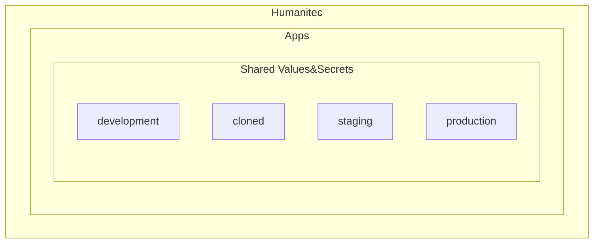

# MVP Workshop - Day 4 - As Developer,

- Golden path DEV-7: I want to onboard a new Workload
- Golden path DEV-8: I want to use define shared values and secrets
- Golden path DEV-9: I want to create new environments
- Golden path DEV-10: I want to deploy my Workload from my CI/CD pipeline

## Golden path DEV-7: I want to onboard a new Workload

See [Workload onboarding](workload-onboarding.md).

## Golden path DEV-8: I want to use define shared values and secrets

```bash
humctl create value DYNAMIC your-value --app ${APP}
```

```bash
humctl create value DYNAMIC your-value-overriden --app ${APP} --env development
```

Grab your available `SecretStore`'s `id` in `SECRET_STORE`:
```bash
humctl api get /orgs/${HUMANITEC_ORG}/secretstores
```

```bash
humctl create value TEST_SECRET test-secret --app ${APP} --is-secret-ref --secret-store ${SECRET_STORE}
```

Open the Humanitec Portal to see these Shared Values&Secrets:
```bash
echo -e "https://app.humanitec.io/orgs/${HUMANITEC_ORG}/apps/${APP}/envs/development/values-and-secrets-overrides"
```

`score.yaml`:
```yaml
apiVersion: score.dev/v1b1
metadata:
  name: my-sample-workload
containers:
  my-sample-container:
    image: .
    variables:
      STATIC_ENV_VAR: "Hello, static!"
      DYNAMIC_ENV_VAR: "${resources.env.DYNAMIC}"
      SECRET_ENV_VAR: "${resources.env.TEST_SECRET}"
```

```bash
humctl score deploy -f score.yaml --image ${IMAGE} --app ${APP} --env development --wait
```

## Golden path DEV-9: I want to create new environments

Either create an empty Environment:
```bash
humctl create env cloned --type development
```
Or cloned if from another Environment:
```bash
humctl create env cloned --type development --from development
```

And then, either deploy a specific Workload in this `cloned` Environment:
```bash
humctl score deploy -f score.yaml --app ${APP} --env cloned --wait
```
Or, deploy the entire Environment in its actual state:
```bash
humctl deploy env cloned cloned --app ${APP}
```
Or, deploy an entire Environment to another:
```bash
humctl deploy env development cloned --app ${APP}
```

## Golden path DEV-10: I want to deploy my Workload from my CI/CD pipeline

In your Jenkins pipeline, GitHub Actions, GitLab Pipelines, you will:
- Install `humctl`
- Run `humctl score deploy` to deploy the `score.yaml` file
- (Optional) [Ephemeral Environment](https://developer.humanitec.com/introduction/tutorials/tutorials-for-developers/deploy-ephemeral-environments/)

Opportunity: at this stage, Developer insert that in their own pipeline definition, sooner rather later, Platform Engineers have an opportunity to author and centralize a pipeline definition template used by the Developers in their own pipelines.

## Bonus

- [`score-compose`](https://docs.score.dev/docs/score-implementation/score-compose/installation/)

## Wrap up


