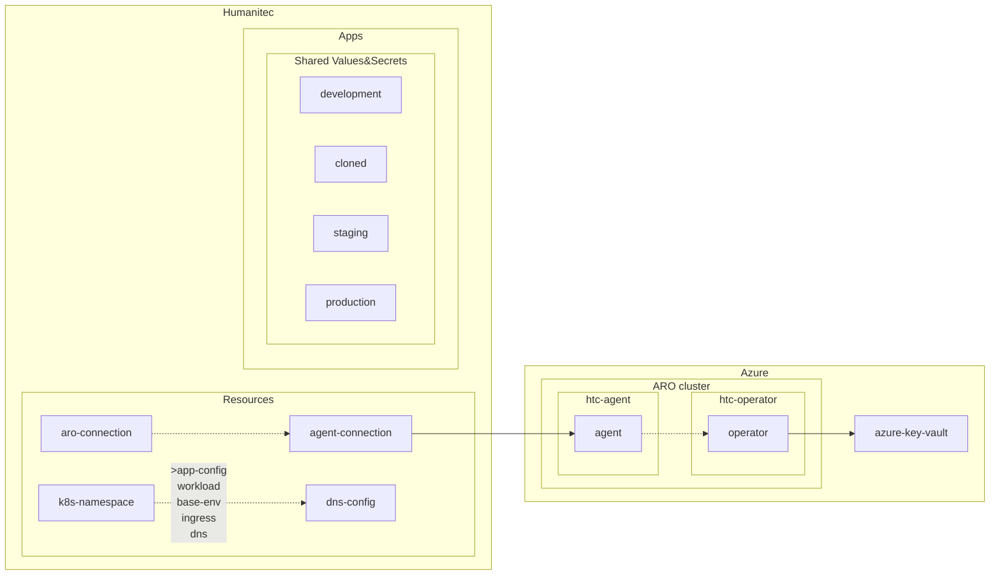

TOC:
- [Prerequisites](#prerequisites)
- [Use Shared Values&Secrets](#dev-use-shared-valuessecrets)
- [Create new Environments](#dev-create-new-environments)
- [Wrap up](#wrap-up)
- [Resources](#resources)

## Use Shared Values&Secrets

```bash
humctl create value DYNAMIC your-value --app ${APP}
```

```bash
humctl create value DYNAMIC your-value-overriden --app ${APP} --env development
```

Grab your available `SecretStore`'s `id` in `SECRET_STORE`:
```bash
humctl api get /orgs/${HUMANITEC_ORG}/secretstores
```

```bash
humctl create value TEST_SECRET test-secret --app ${APP} --is-secret-ref --secret-store ${SECRET_STORE}
```

Open the Humanitec Portal to see these Shared Values&Secrets:
```bash
echo -e "https://app.humanitec.io/orgs/${HUMANITEC_ORG}/apps/${APP}/envs/development/values-and-secrets-overrides"
```

`score.yaml`:
```yaml
apiVersion: score.dev/v1b1
metadata:
  name: my-sample-workload
containers:
  my-sample-container:
    image: .
    variables:
      STATIC_ENV_VAR: "Hello, static!"
      DYNAMIC_ENV_VAR: "${resources.env.DYNAMIC}"
      SECRET_ENV_VAR: "${resources.env.TEST_SECRET}"
```

```bash
humctl score deploy -f score.yaml --image ${IMAGE} --app ${APP} --env development --wait
```

## Create new Environments

Either create an empty Environment:
```bash
humctl create env cloned --type development
```
Or cloned if from another Environment:
```bash
humctl create env cloned --type development --from development
```

And then, either deploy a specific Workload in this `cloned` Environment:
```bash
humctl score deploy -f score.yaml --app ${APP} --env cloned --wait
```
Or, deploy the entire Environment in its actual state:
```bash
humctl deploy env cloned cloned --app ${APP}
```
Or, deploy an entire Environment to another:
```bash
humctl deploy env development cloned --app ${APP}
```

## Wrap up



- `humctl score available-resource-types` is listing to the Devs they golden paths supported.
- Let's look inside the cluster: `kubectl get all,workloads,resources,secretmappings`
- All `.tf` were about Org-level objects in Humanitec.
- All `humctl` commands creating objects in Humanitec were either at the App level, Env level or Workload's deployment level.
- Some of these `humctl` commands creating objects in Humanitec can be written in `.tf` too.
- Next steps: Operator and Terraform Driver. Anything else?
